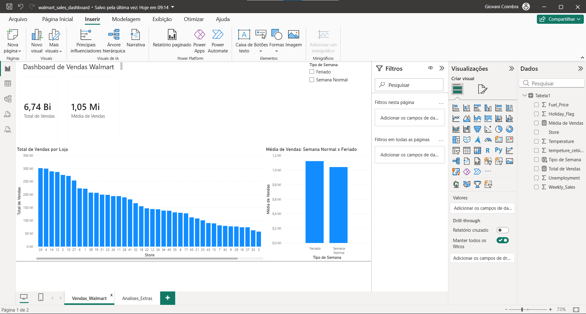
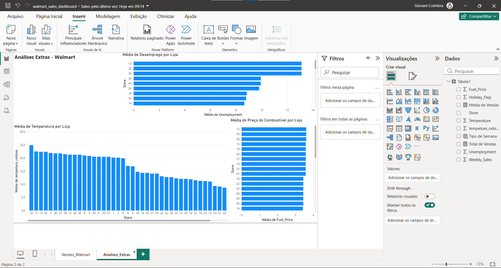

# Power BI Data Analysis

Repositório criado para armazenar projetos de análise de dados e dashboards desenvolvidos com Power BI.

## Projetos

### Walmart Sales Dashboard

Dashboard desenvolvido no Power BI utilizando dados de vendas do Walmart.

O projeto contém:

* Total de vendas
* Média de vendas
* Vendas por loja
* Comparação entre semanas normais e semanas de feriado
* Análises extras de temperatura, combustível e desemprego

## Visualizações do Projeto

### Dashboard de Vendas

### Análises Extras

## Arquivo do Projeto

O arquivo do dashboard em Power BI está disponível neste repositório:

* `walmart_sales_dashboard.pbix`

## Ferramentas utilizadas

* Power BI
* Excel
* Medidas DAX
* Gráficos
* Segmentações de dados

## Objetivo

Praticar análise de dados, criação de dashboards e visualização de informações para portfólio.
